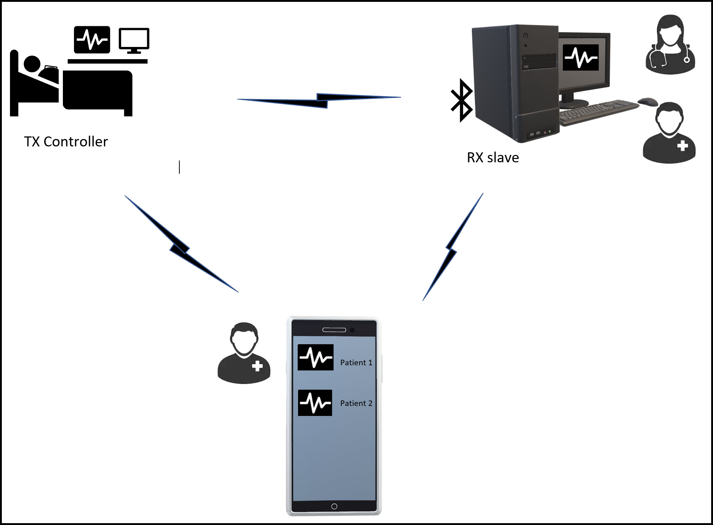
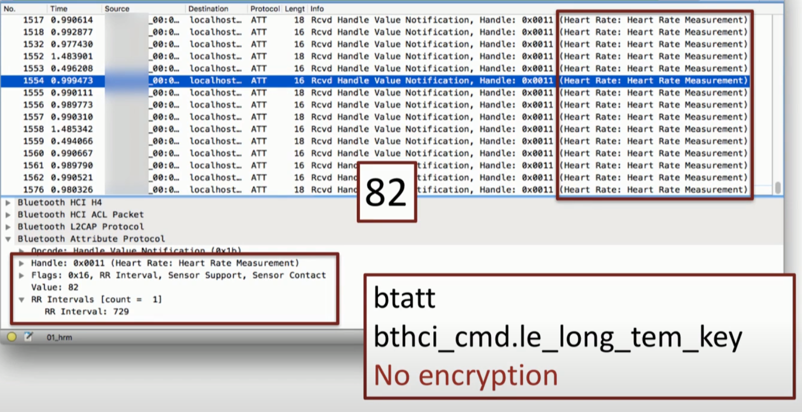

```{js, echo=FALSE}
$('.title').css('color', 'red')
```

```{css echo=FALSE}
/* Define a margin before h2 element */
h1  {
#margin-top: 6em;
  margin-top:20px;
}
```


<style type="text/css">
.main-container {
  max-width: 1320px;
  margin-left: auto;
  margin-right: auto;
  margin-top: 120px;
  margin-bottom; 30px;
  box-shadow: 0px 0px 5px 5px rgba(0,0,0,0.40);
  -webkit-box-shadow: 0px 0px 5px 5px rgba(0,0,0,0.40);
  -moz-box-shadow: 0px 0px 5px 5px rgba(0,0,0,0.40);
 

}
</style>


```{css, echo=FALSE}
pre {
  max-height: 600px;
  overflow-y: auto;
  
}

pre[class] {
  max-height: 3000px;
}
```


```{css, echo=FALSE}
body {
  background-color: #CDE8FF;
  body: red;
  #box-shadow: 0px 3px 50px 0px rgba(43,45,66,0.4);
  #font-family: "Times New Roman", Times, serif;
  #margin-left: 150px;
  #box-shadow: -9px 0 5px -5px #888888, 9px 0 5px -5px #888888;
  #box-shadow: -10px 0 13px -11px black, 10px 0 13px -11px black;
  # box-shadow:0px 0px 2px 2px black;
}
```


```{css, echo=FALSE}
.reveal section img {
border-color: #000;

}
```

```{css, echo=FALSE}
tr:nth-child(even) {
  background: #D8D1C7;
}

```


```{css, echo=FALSE}
# .vl {
#   border-left: 6px solid green;
#   height: 500px;
#   position: absolute;
#   left: 50%;
#   margin-left: -3px;
#   top: 0;
# }

```

<style>
body, h1, h2, h3, h4 {
    font-family: "Times New Roman, Times;
}

body {
    border: 6px double #58514b;
    outline: 4px outset rgba(28,110,164,0.61); 
    outline-offset: 11px;
    color:
}
a, a:hover {
    color: ;
}
pre {
    font-size: 12px;
}
</style>


```{r set-options, echo=FALSE, cache=FALSE}
options(width = 100)
#image: 
#Here is some text, <p style="color:red">this part of which is red!</p>
```


```{r, echo=FALSE}
# htmltools::img(src = knitr::image_uri(file.path("C:/Users/Nitie/Desktop/Motive_Intelligence/Projects/AIHEAD_measure/Motive_logo.png")),
#                alt = 'logo',
#                style = 'position:absolute; top:0px; right:50px; padding:50px;')
```

***
<style>
div.yellow { background-color:#FAEBD7; border-radius: 5px; padding: 20px;}
</style>
<div class = "yellow">

## System Specifications
__The Customer`s Medical Heart Rate Monitoring System comprises of the following components.__


* A heart rate variability monitor strapped to the patient`s chest.Acute Patients are immobilized in the ICU.

* A wireless reciver subsytem is installed in the montoring room 30ft away from the bedside.The equipment vendor supplied the equipment 5 years ago, tested and verified that the transmitted R-R intervals would display on the monitoring station.
* A mobile App enhanced to provide mobile monitoring capabilities.


```{r echo=FALSE, out.width='45%'}


```

__Simulated Link.__

The simulated link is built to allow collection of open source bluetooth link logs.

* Tx Controller: A Dell Inspiron 7559 bluetooth interface car
* A decommissioned phone with an activated host controller interface(adb) feature set 
[The Android Debug Bridge (ADB) tool is part of the Android Open Source Project.(AOSP) Specification Page] (https://source.android.com/setup/build/adb)
* Wireshark network Protocol Analyser 

</div>
..

**** 
<style>
div.yellow { background-color:#FAEBD7; border-radius: 5px; padding: 20px;}
</style>
<div class = "yellow">

## Methodology

The business technical goals and trade offs were considered in characterizing the system.The AIC Triad were the most pertinent for the user.It is a venerable method used for analysing end to end network performance. 

* Availability: High availability system desired
* Integrity:  Ensure R-R interbeat intervals transmitted without structural variation
* Confidentiality: Secure Protected Health Information (PHI) transmitted over the wireless link. 

```{r echo=FALSE, out.width='45%'}
knitr::include_graphics('./link_budget_diagram.png')

```

* Operating frequency:2400 -2483MHZ range within ISM band 2.4Ghz band
* Channel info: 79 Channels seperated by 1/2 MHz 
* Network Topology: Point to point
* Modulation coding scheme: GFSK,DQPSK,8DPSK different for BLE or BR/EDR

</div>
****
```{r, message=FALSE, warning=FALSE}
library(plotly)
library(stats)
library(tidyr)
library(epitools)
library(prettyR)
library(plotrix)
library(ggplot2)
library(reshape2)
library(dplyr)
library(MASS)
library(VIM)
#library(mice)
library(data.table)
library(stringi)
library(stringr)
library(RColorBrewer)
library(DBI)
library(e1071)
library(tidyverse)
library(pastecs)
library(ggpubr)
library(rstatix)
library(car)
library(modeest)
library(DT)
library(expss)
#library(rlist)
library(gdata)
library(lubridate)
library(dbplyr)
library(Hmisc)
library(sqldf)
library(broman)
library(univOutl)
library(ggstatsplot)
library(fitdistrplus)
library(WeibullR)
library(tolerance)
#library(bigmemory)
#library( REdaS)
library(changepoint)
library(inflection)
library(ggpmisc)
library(DescTools)
```
## Results {.tabset .tabset-fade .tabset-pills}

### Input


___Returns: Dataframe of the dataset imported from sdl.medicalclaims table Msc database ___
```{r}
#dt_Bt_Link <- read.csv2("bt_Link_kpi_1.csv", header=TRUE, sep=",") 

#setwd("C:/Users/narhuidese/Desktop/USF/HS631_lectures")

dt_Bt_Link <- read.csv2("./data/bt_Link_kpi_1.csv", header=TRUE, sep=",") 
#head(as.data.frame(dt_Bt_Link),n = 10)
datatable(head(dt_Bt_Link,20), rownames = TRUE, options = list(autoWidth = TRUE,pageLength = 7, scrollX=T),caption = 'Table 1: Aggregate link dataset' )
```
```{r}
#head(dt_Bt_Link,10)
```


```{r}
# datatable(head(dt_Bt_Link,20), rownames = TRUE, options = list(autoWidth = TRUE,pageLength = 7, scrollX=T),caption = 'Table 1: Aggregate link dataset' )
```


```{r}
#str(dt_Bt_Link)
#dt_unique <- unique(dt_Emh)
#nrow(dt_unique)
#rm(dt_unique)
dt_Bt_Link_1 <- dt_Bt_Link
```
 


Restructure the datatypes
```{r}
dt_Bt_Link_1$BT_MAC_Throughput_DL.1 <- as.numeric(as.character(dt_Bt_Link_1$BT_MAC_Throughput_DL.1))
dt_Bt_Link_1$Tx_Power_.dBm._class.2  <- as.numeric(as.character(dt_Bt_Link_1$Tx_Power_.dBm._class.2 )) #as.numeric(as.character(x))
dt_Bt_Link_1$Rx.Power..dBm. <- as.numeric(as.character(dt_Bt_Link_1$Rx.Power..dBm.))
dt_Bt_Link_1$Physical_Layer.PHY.  <- as.character(dt_Bt_Link_1$Physical_Layer.PHY. )
dt_Bt_Link_1$Link_Margin <- as.numeric(as.character(dt_Bt_Link_1$Link_Margin))
dt_Bt_Link_1$Signal_to_Noise_Ratio  <- as.numeric(as.character(dt_Bt_Link_1$Signal_to_Noise_Ratio ))
dt_Bt_Link_1$Max_number_of_retransmission  <- as.factor(dt_Bt_Link_1$Max_number_of_retransmission)

```

Returns: Change structure of the data variables 
```{r}
#str(dt_Bt_Link_1)
#str(dt_Emh1)
```


```{r}
#head(dt_Bt_Link_1,50)
```

Check for NA`S

```{r}
 any(is.na(dt_Bt_Link_1))
```
### Availability

Availability is dependent on uptime & downtime that may be due to any to possible equipment outage,power failure or fading.The link was designed to be a high reliability link of "five nines". 

Availability Metric: Mean time between failure. MTBF/(MTBF+MTTR)
 * The receiver must have a sensitivity level for which the bit error rate (BER) 0.1% is met.

Distribution of Rx Lev at the input of the receiver detector.
Create group variable for link performance. Categorize RXlev by noise floor
```{r}
#if RxLev > Sensitivity + link margin threshold = Uptime
#if link margin threshold > Rxlev & Rxlev > Sensitivity = danger zone
#if  RxLev < sensitivity = unintelligible transmission.

#Categorize the  RXlev by noise floor into 2 groups
dt_Bt_Link_1$RxLev_cat[dt_Bt_Link_1$Rx.Power..dBm. > (dt_Bt_Link_1$Rx_Sensitivity_.dBm)] = "Uptime"
dt_Bt_Link_1$RxLev_cat[dt_Bt_Link_1$Rx.Power..dBm. <= (dt_Bt_Link_1$Rx_Sensitivity_.dBm.)] = "Downtime"

```


```{r}
#Categorize the Sensitivity into two groups
dt_Bt_Link_1$Sensitivity_cat[dt_Bt_Link_1$Rx_Sensitivity_.dBm. > -90] = "Sensitivity_drop"
dt_Bt_Link_1$Sensitivity_cat[dt_Bt_Link_1$Rx_Sensitivity_.dBm. <= -90]= "Sensitivity_normal"
```


```{r}
#head(dt_Bt_Link_1)
```

```{r}

```

```{r}
table(dt_Bt_Link_1$RxLev_cat)
```

Pie chart of performance of the Link

___Returns: Frequency table of link performance___
```{r}
sort(table(dt_Bt_Link_1$RxLev_cat))
Av <- as.data.frame(table(dt_Bt_Link_1$RxLev_cat))
```


___Returns: Plot of distribution of availability.
```{r fig.cap ='Fig 1:Frequency distribution of the denominator physicians '}
p<- ggplot(Av, aes(x="Link Availability", y=Freq, fill=Var1))+
geom_bar(width = 1, stat = "identity")
pie1 <- p + coord_polar("y", start=0)
pie1
```


```{r}
#Availabilty = Uptime/(uptime + downtime) 
Availability = (Av$Freq[2]/(Av$Freq[2]+Av$Freq[1]))*100
Availability

```
__Returns: .Number of times that Rxlev was at the certain value.___
The confidence interval shown for the system parameter bellow assumes normal distribution. 95% confidence interval of the RxLev is the range that contains the true value of the estimated parameter. 
```{r fig.cap ='Fig 9:Histogram of measure rate with summary stats', fig.height = 8, fig.width = 8}

# for reproducibility
set.seed(123)

# plot
histmr <- gghistostats(
  data = dt_Bt_Link_1,
  x = Rx.Power..dBm.,
   binwidth = 0.6,
  #y=stat(count)/sum(stat(count)),
  normal.curve = TRUE, # superimpose a normal distribution curve
  normal.curve.args = list(color = "red", size = 1),
  conf.level = 0.95,
  bar.measure = "proportion",
  k=2,
  #type ="nonparametric",
  type = "robust",
  robust.estimator ="mom",
  #bar.fill = "green",
  bin.args = list(color = "black", fill = "#0088B1FF", alpha = 0.7),
  #ggtheme = ggstatsplot::theme_ggstatsplot(),
  ggtheme = ggplot2::theme_gray(),
  ggplot.component = list(theme(axis.text = element_text(colour = "blue"),text = element_text(size=15),plot.title = element_text(color = "red", size = 14, face = "bold"),plot.subtitle = element_text(color = "blue",size = 12)),
  ylab("Percentage of time"), xlab("Rx Power Level "),ggtitle(labs(title = "Distribution of RxLev"))),
  messages = FALSE
)
histmr 

# p + theme(
#   plot.title = element_text(color = "red", size = 12, face = "bold"),
#   plot.subtitle = element_text(color = "blue"),
#   plot.caption = element_text(color = "green", face = "italic")
# )


```


```{r}
#dt_IMgn1$MarketScan_Specialty <- vlookup(dt_IMgn1$ProviderNPI,dt_phy_spec,result_column = 2,lookup_column = 1)
#head(dt_Aih1)
#dt_Emh1$MarketScan_Specialty <- vlookup(dt_Emh1$ProviderNPI,dt_phy_spec,result_column = 2,lookup_column = 1)
#head(dt_Emh1)
#str(dt_IMgn1)
```

___Returns: Probability Density of RxLev grouped by avaialbility___
Which rxLev value contribute the most to avaialability?

```{r}
#age by mortality
Densityplot <- ggplot(data = dt_Bt_Link_1,aes(x=Rx.Power..dBm.,fill=RxLev_cat))+
  geom_density(alpha = 0.7,cex=1)+ggtitle(labs(title = "Distribution of RxLev grouped by Availability"))+theme(text = element_text(size=10))
Densityplot 
```

___Returns: Distribution of Receive level by avaialbility___
```{r}
#INR value grouped by icd9 categories
Histogram2 <- ggplot(data = dt_Bt_Link_1,aes(x=Rx.Power..dBm.,fill=RxLev_cat))+
  geom_histogram(alpha = 0.7,binwidth = .8,cex = 6,position = "dodge")+ggtitle(labs(title = "Histogram of Rxlev grouped by availability"))+theme(text = element_text(size=10))
Histogram2
```


___Returns: Plot of sensitivity by availability___
```{r}
#INR value grouped by icd9 categories
Histogram3 <- ggplot(data = dt_Bt_Link_1,aes(x=Rx_Sensitivity_.dBm.,fill=RxLev_cat))+
  geom_histogram(alpha = 0.7,binwidth = .1,cex = 3,position = "dodge")+ggtitle(labs(title = "Histogram of Sensitivity grouped by Availability  "))+theme(text = element_text(size=10))
Histogram3
```

```{r}
Histogram2
Histogram3
```


First summarise and transform your data:gender GROUPED BY rxlev cat
___Returns: A plot of the impact of sensitivity on the outage or downtime.
```{r}

d4 <- dt_Bt_Link_1 %>% 
  group_by(Sensitivity_cat,RxLev_cat) %>% 
  summarise(count=n()) %>% 
  mutate(perc=count/sum(count))
bar4 <- ggplot(data=d4, aes(x=Sensitivity_cat, y=perc, fill=RxLev_cat)) + 
  geom_bar(position = 'dodge', stat ='identity')+scale_y_continuous(labels = scales::percent)+labs(x = "Sensitivity", y = "Percentage of availability", fill = "Availability") + ggtitle(labs(title = "Device Sensitivity by availability"))+ theme(text = element_text(size=10))+ geom_text(aes(label = scales::percent(perc),y = perc),position=position_dodge(width=0.7), vjust = -0.25,size=3.5)
bar4  + facet_grid(. ~ Sensitivity_cat,scales='free')
```


### Integrity

Throughput: Rx Device gauranteed throughput based on QOS - quality of service of the system. This system has a capacity of 2Mbps. As seen bellow,the through put is not consistent.


___Returns: A plot of throughput delivered with respect to time___

```{r}
# Multiple line plot
ggplot(dt_Bt_Link_1, aes(x = Time_.sec., y = BT_MAC_Throughput_DL.1)) + 
  geom_line(aes(color = RxLev_cat), size = 1.5)  + ggtitle(labs(title = "Bluetooth Device downlink throughput"))+ theme(text = element_text(size=10))
```


### Confidentiality

___Returns: Number of Descriptive Statistics of Receive Power.___

Assumption: Normal distribtution because of the Central Limit theorem for large dataset where n >> 30
```{r cols.print=4, rows.print=20}
set.seed(1243)
x<-as.data.frame(stat.desc(dt_Bt_Link_1$Rx.Power..dBm., basic=TRUE, desc=TRUE, norm=TRUE, p=0.95))

x$`stat.desc(dt_Bt_Link_1$Rx.Power..dBm., basic = TRUE, desc = TRUE, norm = TRUE, p = 0.95)` <- round(x$`stat.desc(dt_Bt_Link_1$Rx.Power..dBm., basic = TRUE, desc = TRUE, norm = TRUE, p = 0.95)`, 2)

names(x)[1] <- "Value"
names(x)[0] <- "Sample Stats"
x
```


___Returns: Number of Physicians with denominator cases and numerator cases.___

```{r echo=FALSE, out.width='45%'}


```

The BLE encryption protocol doesn`t is not shown in the wireshrk Bluettoth protocols. I have not seen it yet. Currently, the encryption scheme used for this link has not been identified.

***
### Conclusion

<style>
div.yellow { background-color:#FAEBD7; border-radius: 5px; padding: 20px;}
</style>
<div class = "yellow">

* The results show that capacity utilization is less than 50%.
* Average RxLev is -70dBm. 
* The receiver experiences desensitization possibly due to hardware failure. 
* Currently the system availability can be gauranteed at 99.759% of the time.

</div>

***
